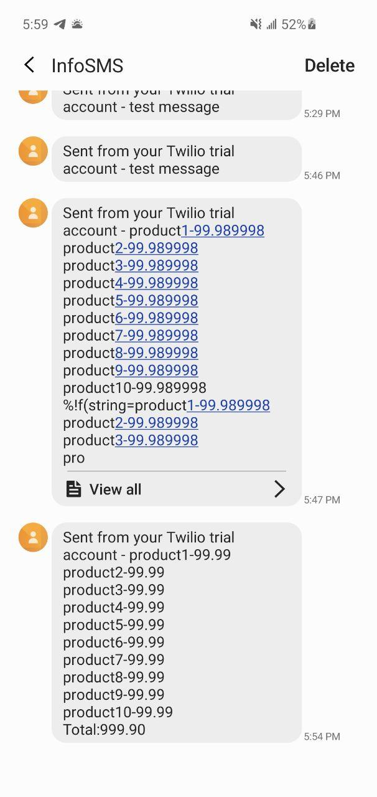
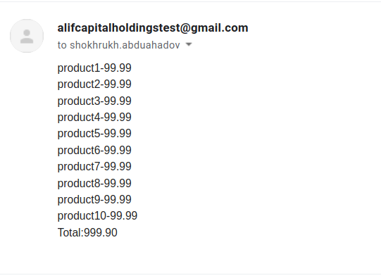

# Alif-Capital-Holdings-task

## Run

```
    // build and run
    go build
    ./Alif-Capital-Holdings-task

    // or
    go run main.go
```

## Result

#### Phone/SMS notif.
> As I am using free sms provider, messages sent to my phone only!
> My number: 998902762986
> Email notification is working as expected




#### Email notif.




## Phone creds

 - +16173907139
- Account Sid: ACa082605f14e2a3f6717fbe77bbc4b8c2
- Auth token: 42cd961afbd2bf8740479b2ba1501591


## Email creds

- gmail

> username: `AlifCapitalHoldingsTest@gmail.com`

> pass: `AlifCapitalHoldings_2020`